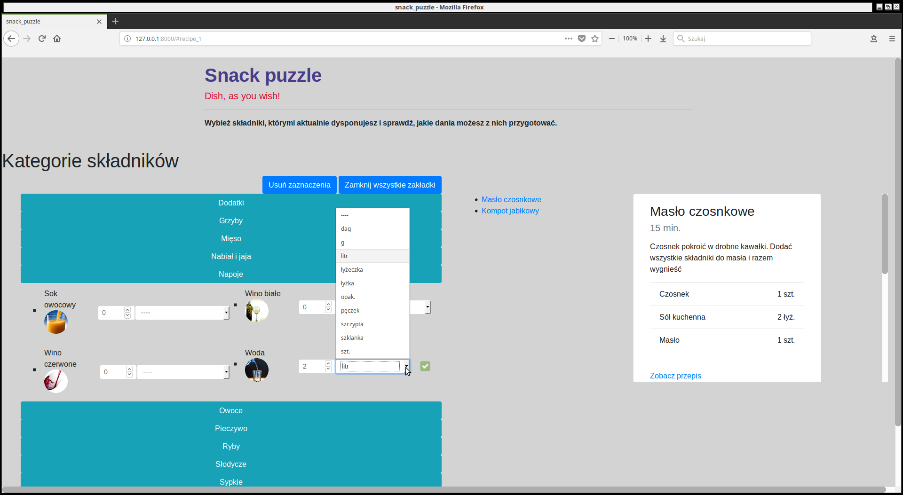

# snack_puzzle
Application that allows people to check what recipes can be prepared with ingredients at hand.  

Implemented:
- Notification when ingredient amount is too low
- Notification when wrong ingredient measure was chosen
- User register and login
- User recipe form
- Searching by time needed for every recipe
